This lab covers all configuration topics on the CCNA exam including, but not limited to, VLANs, EtherChannel, HSRP, RSTP, static/dynamic routing protocols, etc..
### Topology
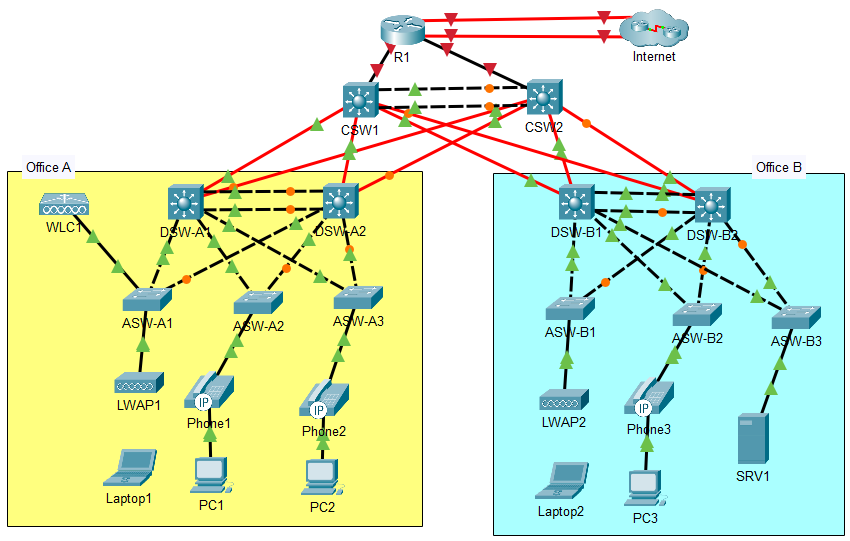
### Part 1 - Initial setup
1. Configure the appropriate hostname on each router/switch.
	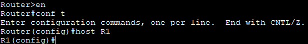
2. Configure the enable secret `jeremysitlab` on each router/switch. Use type 9 hashing if available; otherwise, use type 5.

	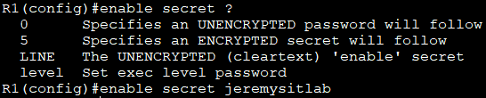
	- Packet tracer does not seem to offer type 9 hashing, only type 5 (MD5)
3. Configure the user account `cisco` with secret `ccna` on each router/switch. Use type 9 hashing if available; otherwise, use type 5.
	
4. Configure the console line to require login with a local user account. Set a 30-minute inactivity timeout. Enable synchronous logging.
	
	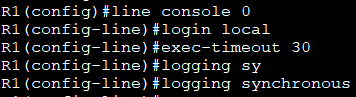

**Repeat these steps for all the other switches/routers**
### Part 2 - VLANS, Layer 2 EtherChannel
1. In Office A, configure a Layer-2 EtherChannel named PortChannel1 between DSW-A1 and DSW-A2 using a Cisco-proprietary protocol. Both switches should actively try to form an EtherChannel.
	- To figure out the interfaces between the two, I used the command `show cdp neighbor` on DSW-A1 and got the following results:
	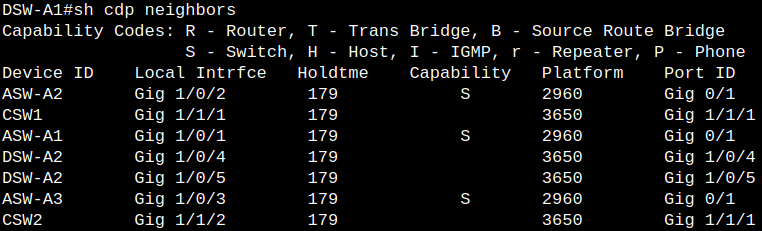
	- This is how I learned that `G1/0/4` and `G1/0/5` are connected to DSW-A2
	- In router config mode, I then used the command `interface range G1/0/4-5` to configure both interfaces simultaneously
	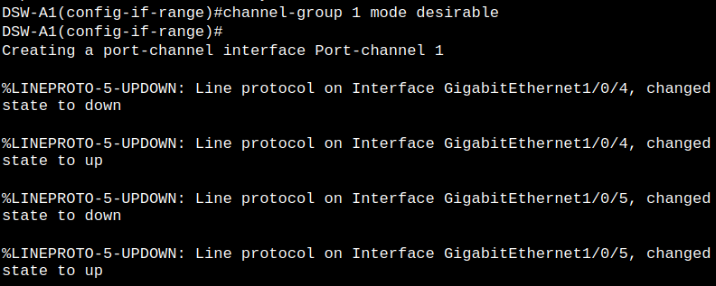
	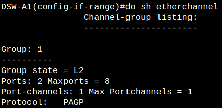
	- I then repeated these same steps for DSW-A2
2. In Office B, configure a Layer-2 EtherChannel named PortChannel1 between DSW-B1 and DSW-B2 using an open standard protocol. Both switches should actively try to form an EtherChannel.
	- Since the requirement states **open standard**, that means we have to use LACP instead of PAgP
	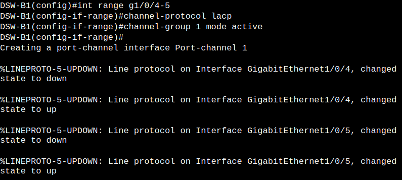
3. Configure all links between Access and Distribution switches, including the EtherChannels, as trunk links.
	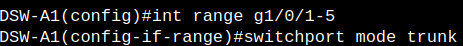
	a. Explicitly disable DTP on all ports.
	- `switchport nonegotiate`
	b. Set each trunk’s native VLAN to VLAN 1000 (unused).
	- `switchport trunk native vlan 1000`
	c. In Office A, allow VLANs 10, 20, 40, and 99 on all trunks.
	- `switchport trunk allowed vlan 10,20,40,99`
	d. In Office B, allow VLANs 10, 20, 30, and 99 on all trunks.
	- `switchport trunk allowed vlan 10,20,30,99`
4. Configure one of each office’s Distribution switches as a VTPv2 server. Use domain name `JeremysITLab`.
	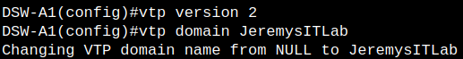
	a. Verify that other switches join the domain.
	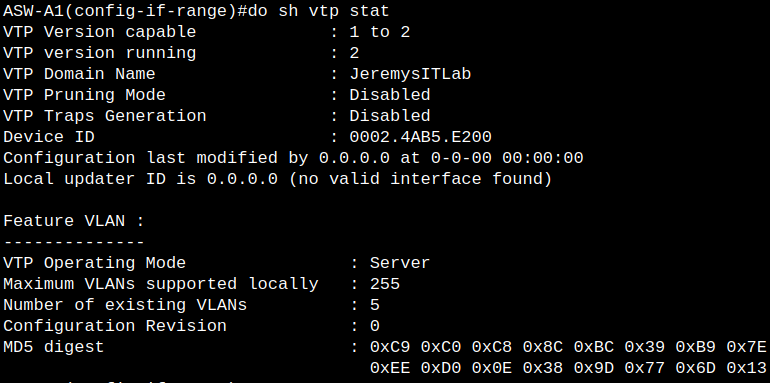
	b. Configure all Access switches as VTP clients.
	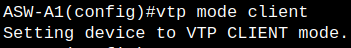
5. In Office A, create and name the following VLANs on one of the Distribution switches. Ensure that VTP propagates the changes.
	a. VLAN 10: PCs
	b. VLAN 20: Phones
	c. VLAN 40: Wi-Fi
	d. VLAN 99: Management
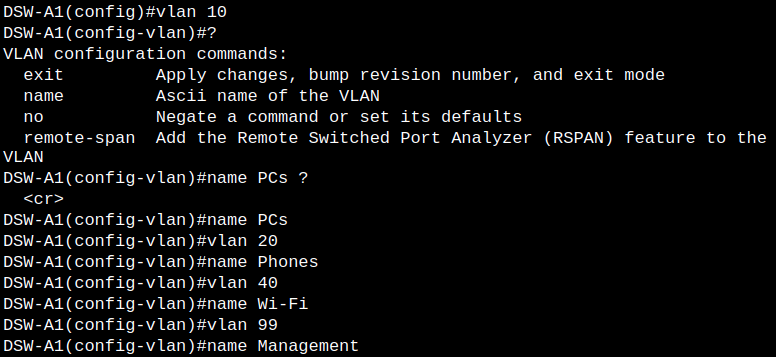
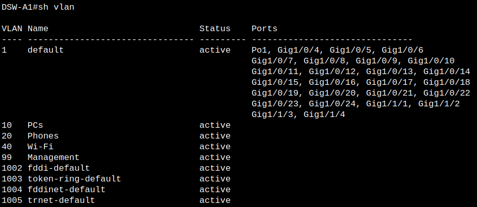
6. In Office B, create and name the following VLANs on one of the Distribution switches. Ensure that VTP propagates the changes.
	a. VLAN 10: PCs
	b. VLAN 20: Phones
	c. VLAN 30: Servers
	d. VLAN 99: Management

7. Configure each Access switch’s access port. 
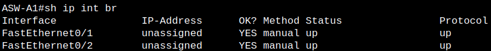
- Since `show cdp neighbors` didn't reveal the other devices, I used the `show ip interface brief` command to figure out F0/1 and F0/2 were connected to the LWAP and WLC
	a. LWAPs will not use FlexConnect
	b. PCs in VLAN 10, Phones in VLAN 20
	- `switchport access vlan 10`
	- `switchport voice vlan 20`
	c. SRV1 in VLAN 30
	- `switchport access vlan 30`
	d. Manually configure access mode and explicitly disable DTP
	- `switchport mode access`
	- `switchport nonegotiate`
8. Configure ASW-A1’s connection to WLC1:
	a. It must support the Wi-Fi and Management VLANs.
	- `switchport mode trunk`
	- `switchport trunk allowed vlan 40,99`
	b. The Management VLAN should be untagged.
	- `switchport trunk native vlan 99`
	c. Disable DTP.
	- `switchport nonegotiate`
9. Administratively disable all unused ports on Access and Distribution switches.
	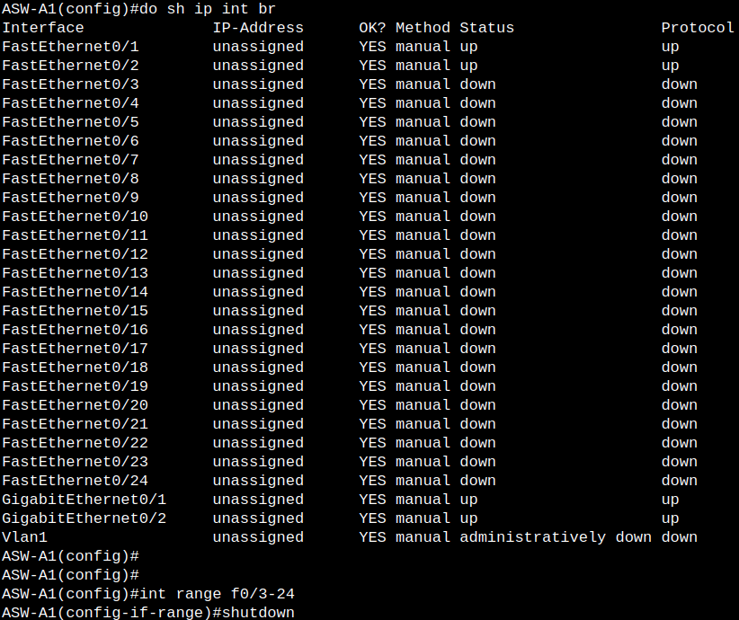
	- Repeat the same steps for the other switches
### Part 3 - IP Addresses, Layer-3 Etherchannel, HSRP
1. Configure the following IP addresses on R1’s interfaces and enable them:
	a. G0/0/0: DHCP client
	b. G0/1/0: DHCP client
	c. G0/0: 10.0.0.33/30
	d. G0/1: 10.0.0.37/30
	e. Loopback0: 10.0.0.76/32
	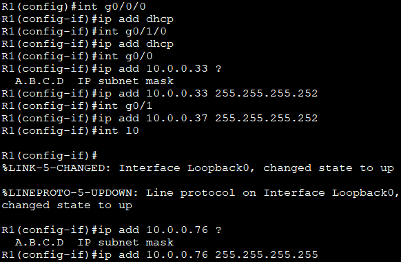
2. Enable IPv4 routing on all Core and Distribution switches.
	- In router config mode, use the command `ip routing`
3. Create a Layer-3 EtherChannel between CSW1 and CSW2 using a Cisco-proprietary protocol. Both switches should actively try to form an EtherChannel. Configure the following IP addresses:
	- First I had to find out which interfaces connect between CSW1 and CSW2 using `show cdp neighbors`
		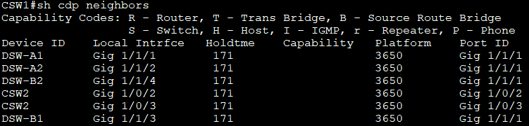
	- I can see that G1/0/2 & G1/0/3 are the two interfaces I'll be working with on both switches
	- Then, I must use the `interface range` command to configure both interfaces at the same time
	- Since this is a Layer-3 etherchannel, I would use the `no switchport` command before configuring the channel-group
	- The prompt states to use a Cisco-proprietary protocol, so I'd use the command `channel-group 1 mode desirable` to use PAgP
		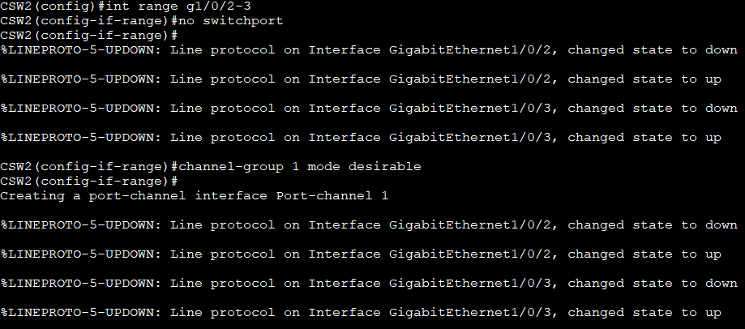
	a. CSW1 PortChannel1: 10.0.0.41/30
		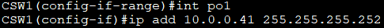
	b. CSW2 PortChannel1: 10.0.0.42/30
	- Same steps as CSW1 but with different IP
4. Configure the following IP addresses on CSW1. Disable all unused interfaces.
	a. G1/0/1: 10.0.0.34/30
		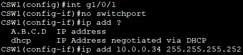
	- I was running into the issue of not being able to add an IP address to this interface, but was able to fix it by using the `no switchport` command
	b. G1/1/1: 10.0.0.45/30
	c. G1/1/2: 10.0.0.49/30
	d. G1/1/3: 10.0.0.53/30
	e. G1/1/4: 10.0.0.57/30
	f. Loopback0: 10.0.0.77/32
5. Configure the following IP addresses on CSW2. Disable all unused interfaces.
	a. G1/0/1: 10.0.0.38/30
	b. G1/1/1: 10.0.0.61/30
	c. G1/1/2: 10.0.0.65/30
	d. G1/1/3: 10.0.0.69/30
	e. G1/1/4: 10.0.0.73/30
	f. Loopback0: 10.0.0.78/32
6. Configure the following IP addresses on DSW-A1:
	a. G1/1/1: 10.0.0.46/30
	b. G1/1/2: 10.0.0.62/30
	c. Loopback0: 10.0.0.79/32
7. Configure the following IP addresses on DSW-A2:
	a. G1/1/1: 10.0.0.50/30
	b. G1/1/2: 10.0.0.66/30
	c. Loopback0: 10.0.0.80/32
8. Configure the following IP addresses on DSW-B1:
	a. G1/1/1: 10.0.0.54/30
	b. G1/1/2: 10.0.0.70/30
	c. Loopback0: 10.0.0.81/32
9. Configure the following IP addresses on DSW-B2:
	a. G1/1/1: 10.0.0.58/30
	b. G1/1/2: 10.0.0.74/30
	c. Loopback0: 10.0.0.82/32
10. Manually configure SRV1’s IP settings:
	a. Default Gateway: 10.5.0.1
	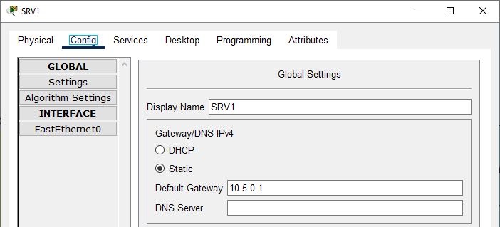
	b. IPv4 Address: 10.5.0.4
	c. Subnet Mask: 255.255.255.0
	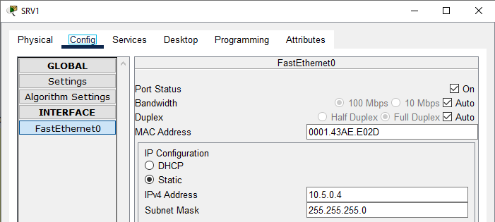
11. Configure the following management IP addresses on the Access switches (interface VLAN 99), and configure the appropriate subnet’s first usable address as the default gateway.
	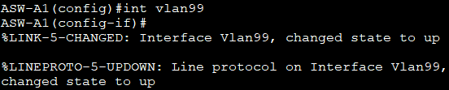
	- ASW-A1: 10.0.0.4/28
	
	- ASW-A2: 10.0.0.5/28
	- ASW-A3: 10.0.0.6/28
	- ASW-B1: 10.0.0.20/28
	- ASW-B2: 10.0.0.21/28
	- ASW-B3: 10.0.0.22/28
12. Configure HSRPv2 group 1 for Office A’s Management subnet (VLAN 99). Make DSW-A1 the Active router by increasing its priority to 5 above the default, and enable preemption on DSW-A1.
	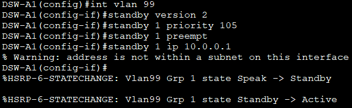
	- Subnet: 10.0.0.0/28
	- VIP: 10.0.0.1
	- DSW-A1: 10.0.0.2
	
	- DSW-A2: 10.0.0.3
	
	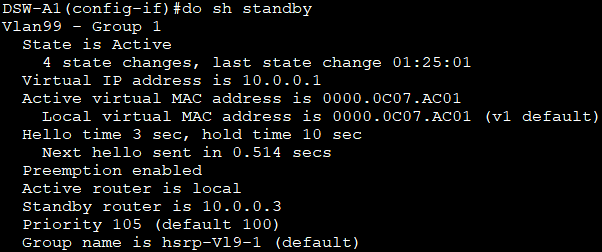
13. Configure HSRPv2 group 2 for Office A’s PCs subnet (VLAN 10). Make DSW-A1 the Active router by increasing its priority to 5 above the default, and enable preemption on DSW-A1.
	- Subnet: 10.1.0.0/24
	- VIP: 10.1.0.1
	- DSW-A1: 10.1.0.2
	- DSW-A2: 10.1.0.3
	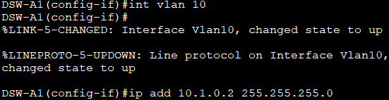
14. Configure HSRPv2 group 3 for Office A’s Phones subnet (VLAN 20). Make DSW-A2 the Active router by increasing its priority to 5 above the default, and enable preemption on DSW-A2.
	- Subnet: 10.2.0.0/24
	- VIP: 10.2.0.1
	- DSW-A1: 10.2.0.2
	- DSW-A2: 10.2.0.3
	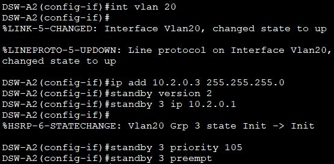
15. Configure HSRPv2 group 4 for Office A’s Wi-Fi subnet (VLAN 40). Make DSW-A2 the Active router by increasing its priority to 5 above the default, and enable preemption on DSW-A2.
	- Subnet: 10.6.0.0/24
	- VIP: 10.6.0.1
	- DSW-A1: 10.6.0.2
	- DSW-A2: 10.6.0.3
	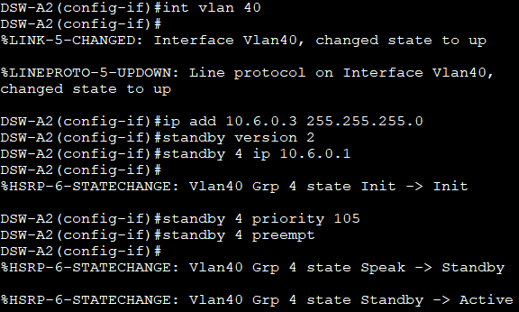
	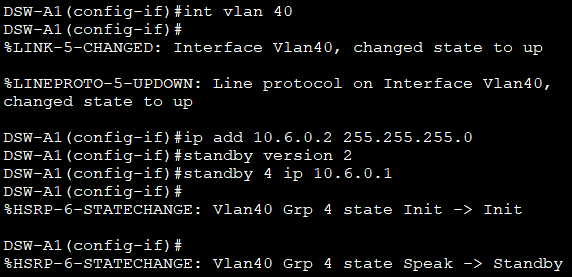
16. Configure HSRPv2 group 1 for Office B’s Management subnet (VLAN 99). Make DSW-B1 the Active router by increasing its priority to 5 above the default, and enable preemption on DSW-B1.
	- Subnet: 10.0.0.16/28
	- VIP: 10.0.0.17
	- DSW-B1: 10.0.0.18
	- DSW-B2: 10.0.0.19
17. Configure HSRPv2 group 2 for Office B’s PCs subnet (VLAN 10). Make DSW-B1 the Active router by increasing its priority to 5 above the default, and enable preemption on DSW-B1.
	- Subnet: 10.3.0.0/24
	- VIP: 10.3.0.1
	- DSW-B1: 10.3.0.2
	- DSW-B2: 10.3.0.3
18. Configure HSRPv2 group 3 for Office B’s Phones subnet (VLAN 20). Make DSW-B2 the Active router by increasing its priority to 5 above the default, and enable preemption on DSW-B2.
	- Subnet: 10.4.0.0/24
	- VIP: 10.4.0.1
	- DSW-B1: 10.4.0.2
	- DSW-B2: 10.4.0.3
19. Configure HSRPv2 group 4 for Office B’s Servers subnet (VLAN 30). Make DSW-B2 the Active router by increasing its priority to 5 above the default, and enable preemption on DSW-B2.
	- Subnet: 10.5.0.0/24
	- VIP: 10.5.0.1
	- DSW-B1: 10.5.0.2
	- DSW-B2: 10.5.0.3
### Part 4 - Rapid Spanning Tree Protocol
1. Configure Rapid PVST+ on all Access and Distribution switches.
	
	a. Ensure that the Root Bridge for each VLAN aligns with the HSRP Active router by configuring the lowest possible STP priority.
	b. Configure the HSRP Standby Router for each VLAN with an STP priority one increment above the lowest priority.
	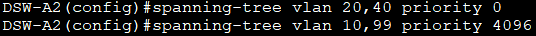
2. Enable PortFast and BPDU Guard on all ports connected to end hosts (including WLC1). Perform the configurations in interface config mode.
	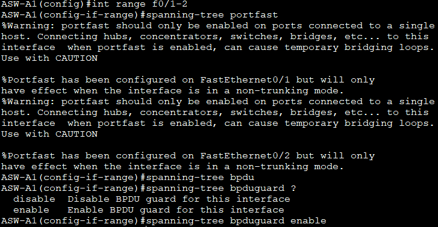
### Part 5 - Static and Dynamic Routing
1. Configure OSPF on R1 (LAN-facing interfaces) and all Core and Distribution switches (all Layer-3 interfaces).
	a. Use process ID 1 and Area 0.
		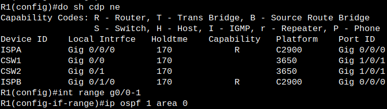
	b. Manually configure each device’s RID to match the loopback interface IP.
		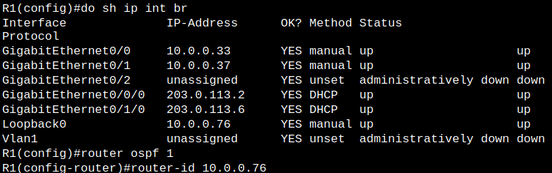
	c. On switches, use the network command to match the exact IP address of each interface.
		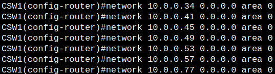
	d. On R1, enable OSPF in interface config mode.
	e. Make sure OSPF is enabled on all loopback interfaces, too. Loopback interfaces should be passive.
		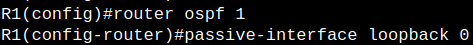
	f. Each Distribution switch’s SVIs (except the Management VLAN SVI) should be passive, too.
	g. Configure all physical connections between OSPF neighbors to use a network type that doesn’t elect a DR/BDR. NOTE: This doesn’t work on the Layer-3 PortChannel interfaces between CSW1/CSW2. Leave them as the default network type.
		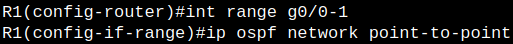
2. Configure one static default route for each of R1’s Internet connections. They should be recursive routes.
	
	a. Make the route via G0/1/0 a floating static route by configuring an AD value 1 greater than the default.
		
	b. R1 should function as an OSPF ASBR, advertising its default route to other routers in the OSPF domain.
		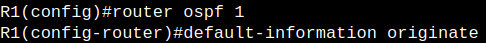
### Part 6 - Network Services: DHCP, DNS, NTP, SNMP, Syslog, FTP, SSH, NAT
**1.** Configure the following DHCP pools on R1 to make it serve as the DHCP server for hosts in Offices A and B. Exclude the first ten usable host addresses of each pool; they must not be leased to DHCP clients.
> **a.** Pool: A-Mgmt
> 
> 
> > **i.** Subnet: 10.0.0.0/28
> > 
> > **ii.** Default gateway: 10.0.0.1
> > 
> > **iii.** Domain name: jeremysitlab.com
> > 
> > **iv.** DNS server: 10.5.0.4 (SRV1)
> > 
> > **v.** WLC: 10.0.0.7
> > 
> **b.** Pool: A-PC **(Repeat the same commands as step A with different IPs)**
> > **i.** Subnet: 10.1.0.0/24
> > **ii.** Default gateway: 10.1.0.1
> > **iii.** Domain name: jeremysitlab.com
> > **iv.** DNS server: 10.5.0.4 (SRV1)
> **c.** Pool: A-Phone
> > **i.** Subnet: 10.2.0.0/24
> > **ii.** Default gateway: 10.2.0.1
> > **iii.** Domain name: jeremysitlab.com
> > **iv.** DNS server: 10.5.0.4 (SRV1)
> **d.** Pool: B-Mgmt
> > **i.** Subnet: 10.0.0.16/28
> > **ii.** Default gateway: 10.0.0.17
> > **iii.** Domain name: jeremysitlab.com
> > **iv.** DNS server: 10.5.0.4 (SRV1)
> > **v.** WLC: 10.0.0.7
> **e.** Pool: B-PC
> > **i.** Subnet: 10.3.0.0/24
> > **ii.** Default gateway: 10.3.0.1
> > **iii.** Domain name: jeremysitlab.com
> > **iv.** DNS server: 10.5.0.4 (SRV1)
> **f.** Pool: B-Phone
> > **i.** Subnet: 10.4.0.0/24
> > **ii.** Default gateway: 10.4.0.1
> > **iii.** Domain name: jeremysitlab.com
> > **iv.** DNS server: 10.5.0.4 (SRV1)
> **g.** Pool: Wi-Fi
> > **i.** Subnet: 10.6.0.0/24
> > **ii.** Default gateway: 10.6.0.1
> > **iii.** Domain name: jeremysitlab.com
> > **iv.** DNS server: 10.5.0.4 (SRV1)
**2.** Configure the Distribution switches to relay wired DHCP clients’ broadcast messages to R1’s Loopback0 IP address.
	
**3.** Configure the following DNS entries on SRV1:
> **a.** google.com = 172.253.62.100
> **b.** youtube.com = 152.250.31.93
> **c.** jeremysitlab.com = 66.235.200.145
> **d.** www.jeremysitlab.com = jeremysitlab.com
> 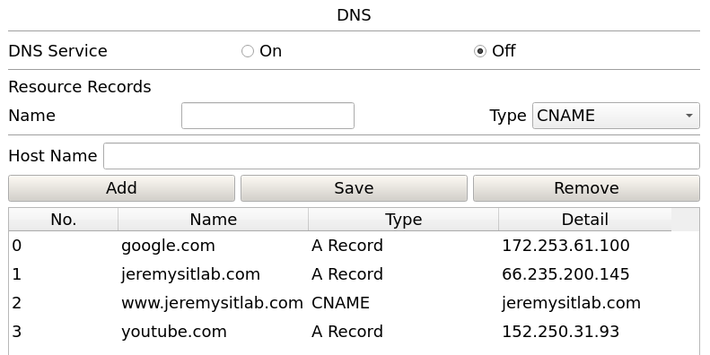
**4.** Configure all routers and switches to use domain name **jeremysitlab.com** and use SRV1 as their DNS server.

- Repeat these steps on all the switches
**5.** Configure NTP on R1:
> **a.** Make R1 a stratum 5 NTP server.
> 
> **b.** R1 should learn the time from NTP server 216.239.35.0.
> 
> **c.** NOTE: NTP takes a LONG time to sync, especially in Packet Tracer. After making the configurations, you can move on – don’t wait for the devices to sync.
**6.** All Core, Distribution, and Access switches should use R1’s loopback interface as their NTP server. 
> **a.** Clients should authenticate R1 using key number **1** and the password **ccna**.
> 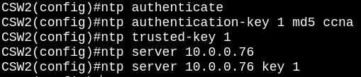
**7.** Configure the SNMP community string **SNMPSTRING** on all routers and switches. The string should allow GET messages, but not SET messages.
	
**8.** Configure Syslog on all routers and switches:
> **a.** Send Syslog messages to SRV1. Messages of all severity levels should be logged.
> 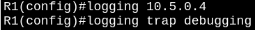
> **b.** Enable logging to the buffer. Reserve 8192 bytes of memory for the buffer.
> 
**9.** Use FTP on R1 to download a new IOS version from SRV1:
> **a.** Configure R1’s default FTP credentials: username **cisco**, password **cisco**.
> 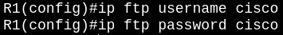
> **b.** Use FTP to copy the file **c2900-universalk9-mz.SPA.155-3.M4a.bin** from SRV1 to R1’s flash drive.
> 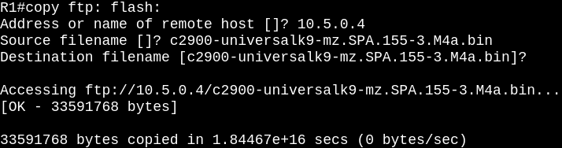
> **c.** Reboot R1 using the new IOS file, and then delete the old one from flash.
> 
> 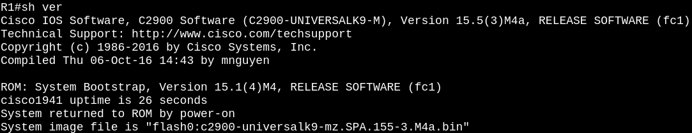
> 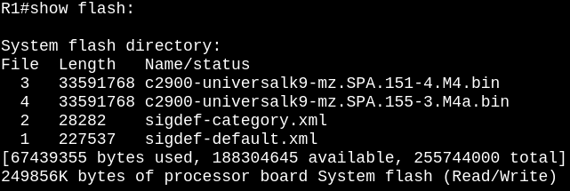
> 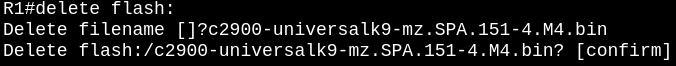
**10.** Configure SSH for secure remote access on all routers and switches.
> **a.** Use the largest modulus size for the RSA keys.
> 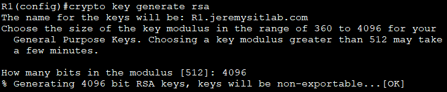
> **b.** Allow SSHv2 connections only.
> 
> **c.** Create standard ACL 1, only allowing packets sourced from Office A’s PCs subnet. Apply the ACL to all VTY lines to restrict SSH access.
> 
> 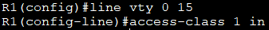
> **d.** Allow only SSH connections to the VTY lines.
> 
> **e.** Require users to log in with a local user account when connecting via SSH.
>
> **f.** Configure synchronous logging on the VTY lines.
> 
**11.** Configure static NAT on R1 to enable hosts on the Internet to access SRV1 via the IP address **203.0.113.113**.
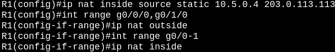
**12.** Configure pool-based dynamic PAT on R1 to enable hosts in the Office A PCs, Office A Phones, Office B PCs, Office B Phones, and Wi-Fi subnets to access the Internet.

> **a.** Use standard ACL 2 to define the appropriate inside local address ranges in the following order:

> > **i.** Office A PCs: 10.1.0.0/24
> 
> > **ii.** Office A Phones: 10.2.0.0/24
> 
> > **iii.** Office B PCs: 10.3.0.0/24
> 
> > **iv.** Office B Phones: 10.4.0.0/24
> 
> > **v.** Wi-Fi: 10.6.0.0/24

> **b.** Define a range of inside global addresses called **POOL1**, specifying the range 203.0.113.200 to 203.0.113.207 with a /29 netmask.
> 
> **c.** Map ACL 2 to POOL1 and enable PAT. Confirm that hosts can access the Internet by pinging jeremysitlab.com.
> 
> **d.** Verify that Internet link failover works by disabling R1’s G0/0/0 interface and pinging again.

> > **i.** You will need to remove and re-configure the OSPF default-information originate command for this to work. In real Cisco routers, you can configure the default-information originate always command that supports failover like this, but the command isn’t available in Packet Tracer.
> 
> > **ii.** Re-enable G0/0/0 (and remove and re-configure default-information originate once again).

**13.** Disable CDP on all devices and enable LLDP instead. 

> **a.** Disable LLDP Tx on each Access switch’s access port (F0/1).